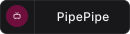
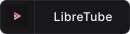

  

TypeType-Android is the native Android client for [TypeType](https://github.com/Priveetee/TypeType), a self-hosted, privacy-respecting video platform.

This project is in **very early development**. Expect breakage, missing features, and incomplete UI.

## What this is

A Kotlin Android application that talks exclusively to a TypeType-Server instance over HTTP. The client carries no extraction engine of its own — all extraction, recommendation, and user-data work happens server-side.

## What this is not

- Not a standalone YouTube client. It does not work without a reachable TypeType-Server.
- Not a Piped, Invidious, or NewPipe client.
- Not affiliated with the LibreTube team. This is an independent codebase that originally started from their work and has since been rewritten in full.

## Stack

| Role | Tool |
|---|---|
| Language | Kotlin |
| Min SDK | 26 (Android 8.0) |
| UI | Jetpack Compose with Material 3 |
| Navigation | Navigation Compose with type-safe routes |
| DI | Hilt |
| Network | Retrofit + OkHttp + kotlinx.serialization |
| Local DB | Room |
| Image loading | Coil |
| Player | Media3 / ExoPlayer |
| Background work | WorkManager |
| Build | Gradle (Kotlin DSL) |
| License | GPL v3 |

## Backend requirement

TypeType-Android requires a running TypeType-Server. The first launch will ask you for the instance URL.

You can either:
- Use a public TypeType instance (none are advertised yet)
- Self-host TypeType-Server (see [TypeType](https://github.com/Priveetee/TypeType) for the full stack)

## Building

Open the project in Android Studio (Hedgehog or newer), let Gradle sync, and run on a device or emulator with API 26 or newer.

A signed release flow and CI publishing will be added later.

## License

GPL v3. See [LICENSE](LICENSE). The codebase originally inherited from LibreTube (also GPL v3), so we keep the licensing model.

## Acknowledgments

TypeType-Android took inspiration and lessons from several projects:

- [LibreTube](https://github.com/libre-tube/LibreTube) by [Bnyro](https://github.com/Bnyro) and contributors — the original codebase we started from, and the reference for the overall Android video-client UX (bottom navigation, home sections, player ergonomics, accent-color theming).
- [Findroid](https://github.com/jarnedemeulemeester/findroid) by Jarne Demeulemeester — architectural reference for the multi-server setup flow, the MVI pattern, Compose Navigation with type-safe routes, and the discipline of a fully server-side native Android client.

Both are GPL v3. TypeType-Android is published under the same license.
