<!-- markdownlint-disable MD033 MD041 -->

  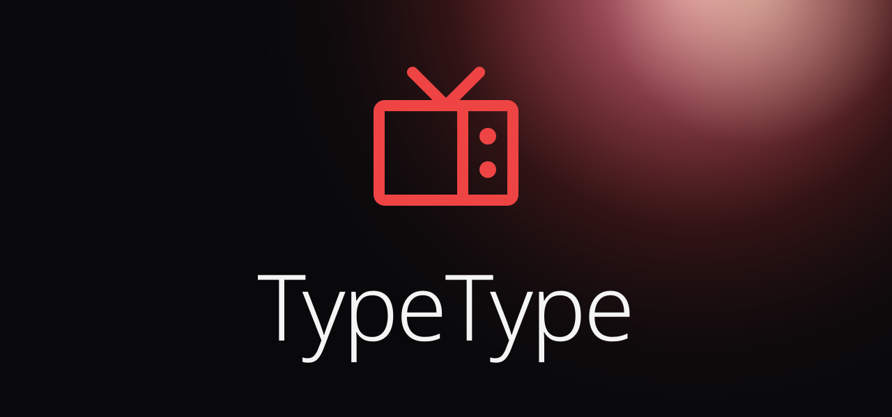
  <h1>TypeType Android</h1>
  
Native Android client for TypeType.

[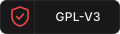](LICENSE)
[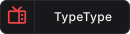](https://github.com/TypeType-Video/TypeType)

<a href="https://typetype.video/fdroid/">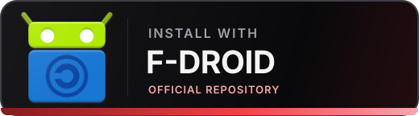</a> <a href="https://github.com/TypeType-Video/TypeType-Android/releases/latest">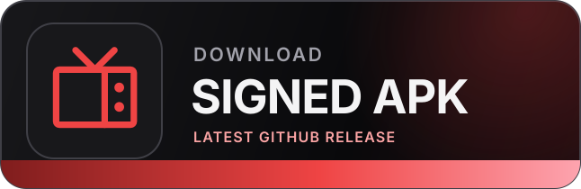</a>

[User guide](https://typetype-video.github.io/Docs-TypeType/guide/) · [Report a problem](https://github.com/TypeType-Video/TypeType-Android/issues)

TypeType Android is a native client for
[TypeType](https://github.com/TypeType-Video/TypeType), a self-hosted video
platform. It provides browsing, account synchronization, downloads, and native
playback on Android phones and tablets.

The Android app is currently in beta and receives frequent updates.

The app communicates exclusively with the TypeType instance selected during
setup. Extraction, playback sessions, recommendations, synchronization, and
server-side downloads remain server responsibilities.

## Screenshots

| Home and Continue Watching | Search | Subscriptions |
| --- | --- | --- |
| 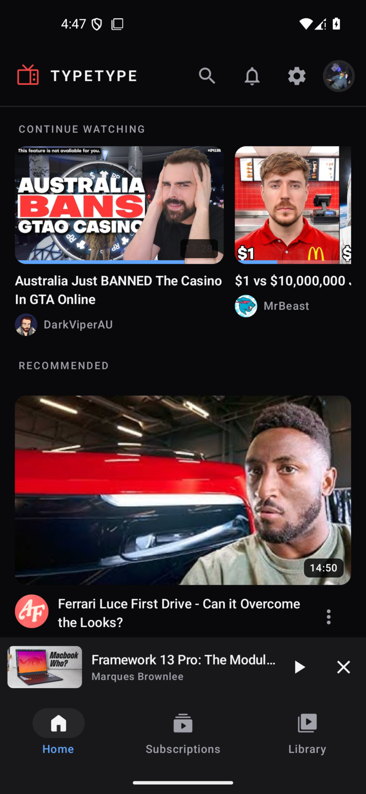 | 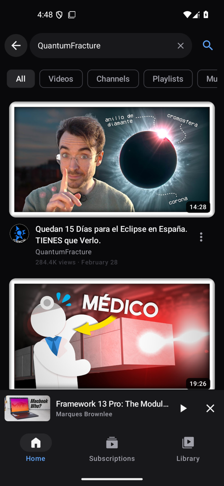 | 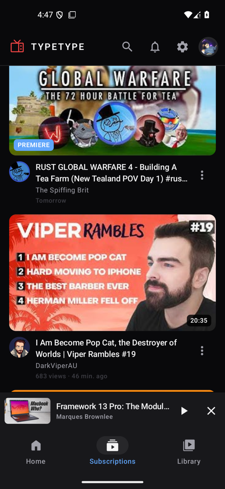 |

| Library and history | Native player | Comments |
| --- | --- | --- |
| 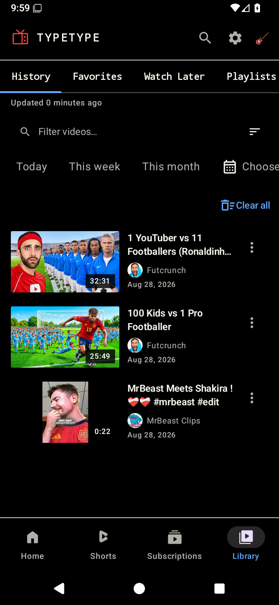 | 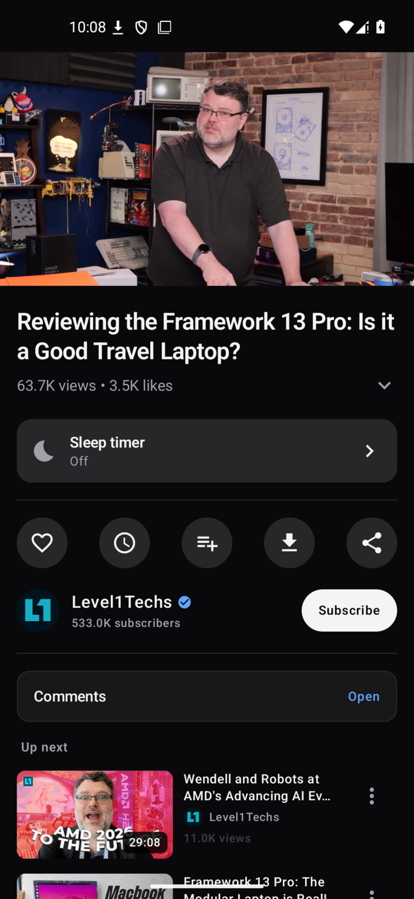 | 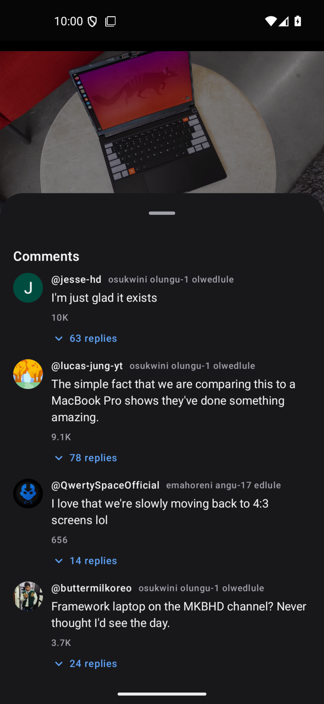 |

| Notifications | Profile | Settings |
| --- | --- | --- |
| 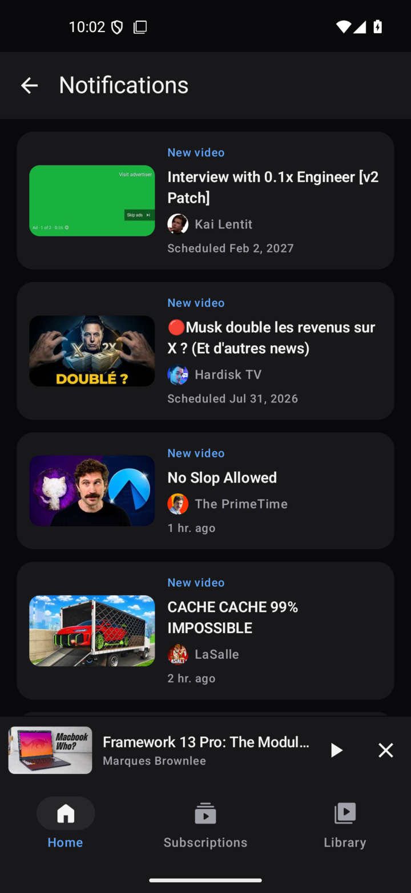 | 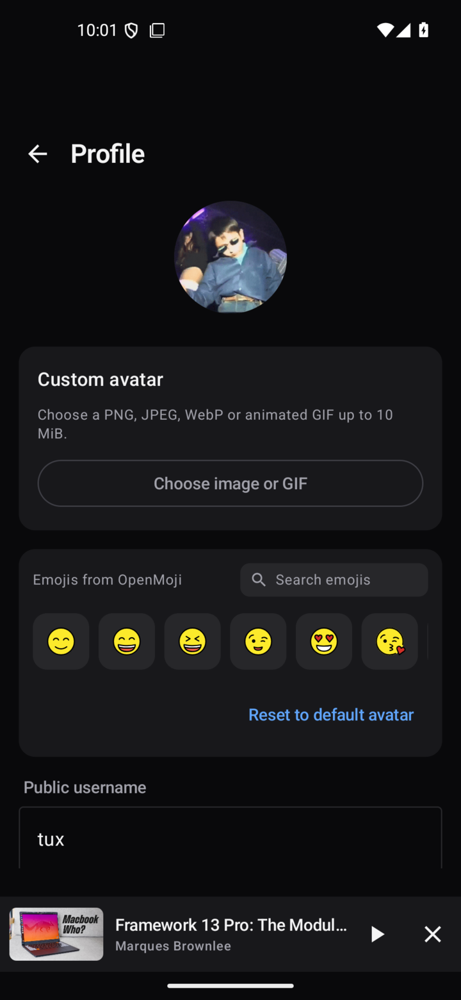 | 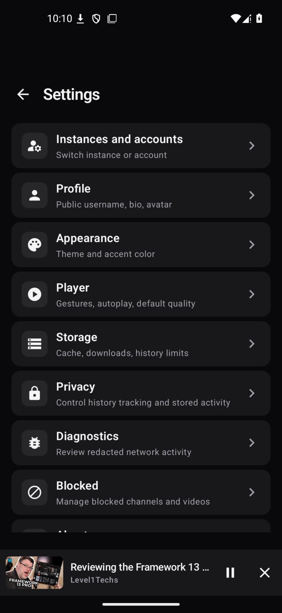 |

## Features

- Resume unfinished videos from Continue Watching.
- Search videos, channels, playlists, music, and other supported content.
- Browse subscriptions with labels for live, premiere, and special videos.
- Access history, favorites, Watch Later, playlists, and notifications.
- Use background audio, Picture in Picture, the mini-player, and audio-only
  playback.
- Choose quality, codec, audio track, captions, playback speed, and image mode.
- Use chapters, SponsorBlock, the playback queue, comments, related videos, and
  the sleep timer.
- Download supported videos and retain cached pages during temporary network
  interruptions.
- Import existing data and manage multiple TypeType instances and accounts.

TypeType Android supports Android 6.0 and newer, and does not require Google
Play Services.

## Install

### F-Droid

Use the official TypeType F-Droid repository to install the app and receive
stable updates:

1. Open the [TypeType F-Droid setup page](https://typetype.video/fdroid/) on
   your Android device, or scan its QR code.
2. Tap **Open in F-Droid**, add the repository, then wait for the catalog to
   refresh.
3. Search for **TypeType** and install it.

### Signed APK

1. Open the
   [latest Release](https://github.com/TypeType-Video/TypeType-Android/releases/latest).
2. Download the signed `TypeType-vX.Y.Z.apk`. A matching SHA-256 file is
   available if you want to verify the download.
3. Open the APK and allow installation from your browser or file manager when
   Android asks.
4. Launch TypeType, enter the address of your TypeType instance, then sign in
   with a local account or OIDC. Guest access appears when the instance supports
   it.

Installing a newer signed Release over an existing Release keeps the
application data. If Android reports an incompatible signature, remove any
Debug build before installing the signed APK.

> [!NOTE]
> TypeType Android is a client for
> [TypeType-Server](https://github.com/TypeType-Video/TypeType-Server). You need
> access to a compatible TypeType instance. If you want to host one, start with
> the [self-hosting guide](https://typetype-video.github.io/Docs-TypeType/self-hosting/introduction).

## Offline behavior and diagnostics

The app keeps available local cache entries visible while refreshing and
resumes progressive feeds after a temporary interruption. Playback, downloads,
and account operations still depend on the selected instance and its upstream
providers.

When something fails, open **Settings > Diagnostics** to review a redacted,
local request history before sharing it. Diagnostics do not include raw
credentials, tokens, cookies, or private response bodies.

## Help and feedback

- Read the [TypeType user guide](https://typetype-video.github.io/Docs-TypeType/guide/).
- Check the [latest Android Releases](https://github.com/TypeType-Video/TypeType-Android/releases).
- Want to help? Read [CONTRIBUTING.md](CONTRIBUTING.md) to get started.
- Report bugs and request features in the
  [TypeType Android issue tracker](https://github.com/TypeType-Video/TypeType-Android/issues).

When reporting a playback or network problem, include the Android version, app
version, TypeType instance version, video URL, the action that failed, and the
redacted diagnostics export when available.

## TypeType ecosystem

- [TypeType](https://github.com/TypeType-Video/TypeType), stack installation,
  releases, and coordination
- [TypeType-Server](https://github.com/TypeType-Video/TypeType-Server), API,
  extraction, playback sessions, and private user data
- [TypeType-Frontend](https://github.com/TypeType-Video/TypeType-Frontend),
  browser client
- [Docs-TypeType](https://github.com/TypeType-Video/Docs-TypeType), user and
  self-hosting documentation

## Acknowledgements

TypeType Android is an independent client. The following GPL v3 projects have
provided useful technical and product references:

- [PipePipe](https://github.com/InfinityLoop1308/PipePipe) and
  [PipePipeClient](https://github.com/InfinityLoop1308/PipePipeClient), for
  Android playback, format selection, SABR diagnostics, and compatibility
  lessons
- [LibreTube](https://github.com/libre-tube/LibreTube), for Android video-client
  UX and Media3 playback lifecycle patterns
- [Findroid](https://github.com/jarnedemeulemeester/findroid), for native
  server-first client architecture and multi-server setup patterns
- [Komi Store](https://github.com/kurikomi-labs/komi-store), for appearance
  personalities and manga-inspired presentation patterns (Apache-2.0)

## License

TypeType Android is licensed under the [GNU General Public License v3.0](LICENSE).

Copyright © 2026 Priveetee and TypeType contributors.
