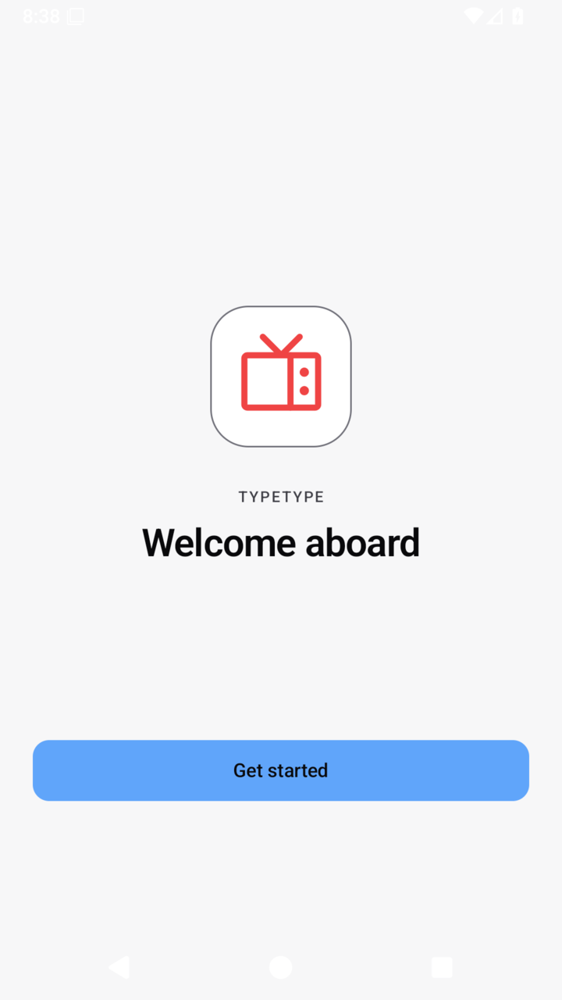
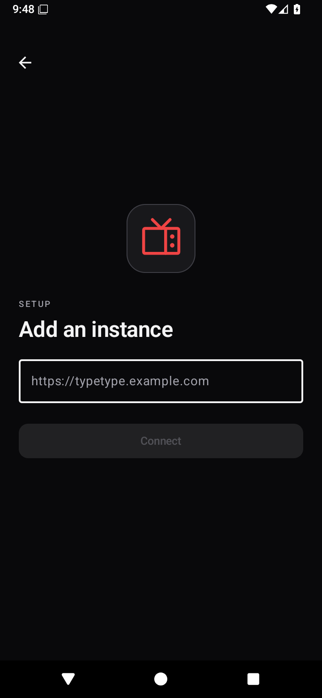

<!-- markdownlint-disable MD033 MD041 -->

<div align="center">
  
  <h1>TypeType Android</h1>
  <p>Native Android client for TypeType.</p>
</div>

<div align="center">

[](LICENSE)
[](https://github.com/TypeType-Video/TypeType)

</div>

<div align="center">

<a href="https://typetype.video/fdroid/"></a> <a href="https://github.com/TypeType-Video/TypeType-Android/releases/latest"></a>

[User guide](https://typetype-video.github.io/Docs-TypeType/guide/) · [Report a problem](https://github.com/TypeType-Video/TypeType-Android/issues)

</div>

TypeType Android is the native client for
[TypeType](https://github.com/TypeType-Video/TypeType), a self-hosted video
platform. The app is in beta, supports Android 6.0 and newer, and does not
require Google Play Services.

TypeType Android uses the TypeType Server selected during setup for extraction,
playback sessions, recommendations, synchronization, and downloads.

The Android TV client is part of this repository in the `tv` module. It is a
separate native TV application that uses the same TypeType SDK and server
contracts as the mobile client.

## Screenshots

| Welcome | Add an instance | Home |
| --- | --- | --- |
|  |  |  |

| Search | Native player | Settings |
| --- | --- | --- |
|  |  |  |

## Features

- Browse and search videos, channels, playlists, music, and subscriptions.
- Resume videos, manage history, favorites, Watch Later, playlists, and
  notifications.
- Play in the background, in Picture in Picture, or with the mini-player.
- Choose quality, codec, audio track, captions, playback speed, and image mode.
- Use chapters, SponsorBlock, comments, related videos, the queue, and the
  sleep timer.
- Download supported videos and import existing data.

## Android TV

Build the TV client with the included Gradle wrapper:

```sh
./gradlew :tv:assembleDebug
```

The TV module targets Android TV devices from API 23 onward and keeps its TV
navigation, focus behavior, layouts, and playback presentation independent from
the mobile UI. Local builds automatically use a sibling `TypeType-SDK`
checkout; set `TYPETYPE_SDK_PATH` when the SDK is stored elsewhere.

## Install

### F-Droid

TypeType Android is one application with two F-Droid channels:

- **Stable** is the recommended channel for normal use.
- **Beta** is for testing prerelease builds.

Both channels use the same application package and signing certificate, so they
update the same installation. Add only Stable for normal use, or add both
repositories to receive Beta updates. Choose a channel from the
[TypeType F-Droid setup page](https://typetype.video/fdroid/):

1. Open the [TypeType F-Droid setup page](https://typetype.video/fdroid/) on
   your Android device, or scan its QR code.
2. Tap **Open in F-Droid**, add the repository, and refresh the catalog.
3. Search for **TypeType** and install it.

### Signed APK

1. Download the signed APK from the
   [latest Release](https://github.com/TypeType-Video/TypeType-Android/releases/latest).
2. Verify it with the matching SHA-256 file if desired.
3. Open the APK and allow installation when Android asks.
4. Enter your TypeType instance address and sign in, use OIDC, or continue as a
   guest when supported.

Installing a newer signed Release over an existing Release keeps the
application data. If Android reports an incompatible signature, remove any
Debug build before installing the signed APK.

> [!NOTE]
> TypeType Android is a client for
> [TypeType-Server](https://github.com/TypeType-Video/TypeType-Server). You need
> access to a compatible TypeType instance. If you want to host one, start with
> the [self-hosting guide](https://typetype-video.github.io/Docs-TypeType/self-hosting/introduction).

## Help and feedback

- Read the [TypeType user guide](https://typetype-video.github.io/Docs-TypeType/guide/).
- Check the [latest Android Releases](https://github.com/TypeType-Video/TypeType-Android/releases).
- Want to help? Read [CONTRIBUTING.md](CONTRIBUTING.md) to get started.
- Report bugs and request features in the
  [TypeType Android issue tracker](https://github.com/TypeType-Video/TypeType-Android/issues).

When reporting a problem, include the Android version, app version, TypeType
Server version, the action that failed, and the redacted diagnostics export
when available.

## Acknowledgements

We warmly thank the teams and contributors behind these projects. Their work,
ideas, and hard-earned lessons have been valuable references while building
TypeType Android, especially for Android compatibility, media playback, and
user experience. TypeType Android remains an independent client and is not
affiliated with these projects.

- [PipePipe](https://github.com/InfinityLoop1308/PipePipe) and
  [PipePipeClient](https://github.com/InfinityLoop1308/PipePipeClient), for
  Android playback, format selection, SABR diagnostics, and compatibility
  lessons
- [LibreTube](https://github.com/libre-tube/LibreTube), for Android video-client
  UX and Media3 playback lifecycle patterns
- [Findroid](https://github.com/jarnedemeulemeester/findroid), for native
  server-first client architecture and multi-server setup patterns
- [Komi Store](https://github.com/kurikomi-labs/komi-store), for appearance
  personalities and manga-inspired presentation patterns (Apache-2.0)

## License

TypeType Android is licensed under the [GNU General Public License v3.0](LICENSE).

Copyright © 2026 Priveetee and TypeType contributors.
